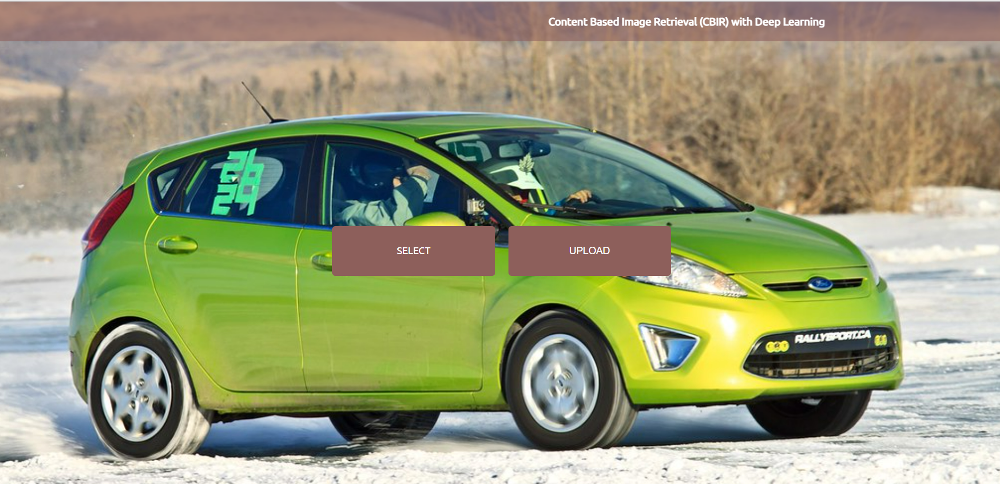

# Image Retrieval
An image retrieval is used for browsing, searching and retrieving images from a large database. 
In our case the main task here would be **image searching** based on either input text or similar image.
Therefore, here are possible pipelines for 2 tasks:
1. Image searching based on input text: 
This task is based on the metadata processing and searching 
1.2 Feature extraction:
* Image classification: 
The simplest way, just to predict the objects (type of car) by the image.  
Then to search by the text, just to compare the input query with images' metadata
* Siamese network (with triplet loss): 

Then choose closest images to query into generated space. 
Pro: the approach can be used both for the image and text query
2. Image searching based on input similar image - Content Based Image Retrieval (CBIR): 

2.1 Feature extraction:  
On this step each image is represented as the embeddings/vectors of image's features. 
Possible solutions: 
* Encoder-Decoder - the architecture to reproduce the image itself. Then the encoder can be used to generate features embedding.
* Image classification architecture (VGG/ResNet) - for the features embedding get the last layer of pre-trained classification model.
* Can be also Siamese network 
2.2 Find the closest images:
* Choose metric (such as Euclidean distance) and compare all images' distances to find the closet ones
* Use any clusterization approach 
3. Multimodal Search: 
In multimodal search the input query include both text and image query. 

Resources:
* [CBIR using CNN](https://medium.com/sicara/keras-tutorial-content-based-image-retrieval-convolutional-denoising-autoencoder-dc91450cc511)
* [CBIR with Siamese networks](https://neptune.ai/blog/content-based-image-retrieval-with-siamese-networks) (also with the text input)
* [Features extraction with Tensorflow (Decoder-Encoder and VGG)](https://www.analyticsvidhya.com/blog/2021/01/querying-similar-images-with-tensorflow/)
* [Multimodal search](https://arxiv.org/pdf/1806.08896.pdf)

# FORD image retrieval
Possible car features
 - Model (Fiesta, Focus, F150, Mustang, Mondeo)
 - Type (Sedan, Hatchback, Crossover, etc)
 - Color (white, red, black, blue, etc)
 - Background (city, mountains, sea, nature, etc)
 - interior or the exterior 
 - Audience 1 (man, woman, child)
 - Audience 2 (age - old or young)

The idea is to be able to find the appropriate images from the DB based on the features above. 
It means that the system would pay special attention to car's model, color, and other features above.

The first task was chosen **CBIR** (Content Based Image Retrieval) - searching by the input image query.
First approach to test for creating images' features was chosen - **Image classification architecture**, 
as there are a lot SOTA architectures with pre-trained models.

Benchmark approach:
1. Features extraction - **VGG16** model pre-trained on [**CIFAR-10** dataset](https://www.cs.toronto.edu/~kriz/cifar.html)

2. For searching metric **cosine similarity** was chosen
3. Flask was used for application's UI
4. Elastic Search for storing and fast searching of the images 

**Some examples of the app**

Input image

Found similar images

## Accuracy
To measure the accuracy for our task we need images with labels of features above.
Then we'd be able to run the application and check whether we are able to find similar images based on the requirements.
Also, we'll need labelled dataset to fine-tune the model.

## Dataset
We've collect dataset in 3 different ways
1. CreativeCommon Data - data scrapped manually for all types of features (images which can be used commercially)
2. [Cars Dataset](http://ai.stanford.edu/~jkrause/cars/car_dataset.html) - open-source dataset - >16K images with labeled model, year and type.
All other features would be labelled using Neural Networks (NN) and human validation.
Includes 196 models of cars (not only Ford)
3. [Auto Scout24](https://www.autoscout24.de/) - crawlers - web-site for selling the cars. Collected around 23K of images with model, 
type, year, color. All other features would be generating using NN and human validation.

All these 3 ways of collecting the data is still in process.
Based on it we'll be able to get the **Benchmark accuracy score** and improve the accuracy if needed by fine-tuning 
the model based on the collected images.

This task can be not only the solution for Ford cars, but also for any other cars and requirements.
All in all, we are creating the general pipeline for this task.

## Benchmark accuracy 
#### (on local Elastic Search)
Overall accuracy per each requirement

Accuracy per requirement and value

Original model             |  Color detection model
:-------------------------:|:-------------------------:
  |  

