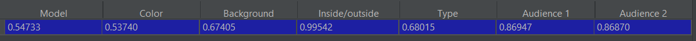
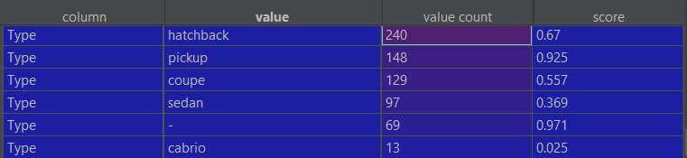
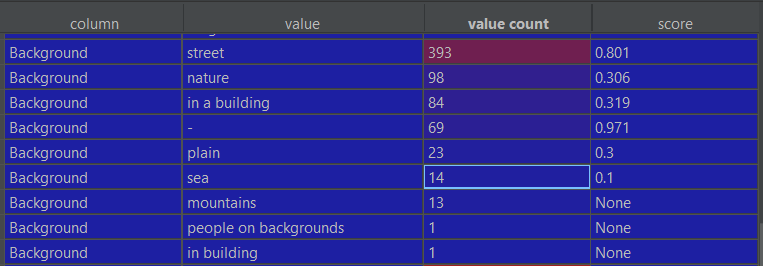
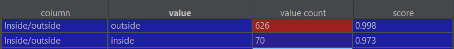
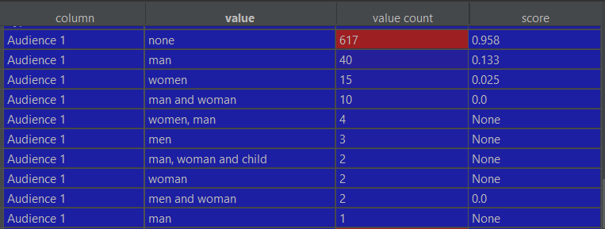

# innovation-hub-2022-challenge-content-tagging

## Local Run
### Settings
1. Clone the repo to your local machine
2. Create **saved-folder** directory and download [vgg16-weights.pth](https://github.com/lamproslntz/cbir-deep-learning/blob/master/saved-model/vgg16-weights.pth)
and [pca.joblib](https://github.com/lamproslntz/cbir-deep-learning/blob/master/saved-model/pca.joblib) there.
3. Download and start Elastic Search (ES) tool ([tutorial](https://www.elastic.co/guide/en/elasticsearch/reference/current/zip-windows.html#windows-service)).
4. For the first run change **ES_PASSWORD** variable in **app.py** file for the password you've set when downloaded ES.

### Run application
1. Start Elastic Search (tip: wait a minute after the ES started)
2. Run **app.py**
3. Open "http://localhost:9200" and use the tool

## Benchmark accuracy 
#### (on local Elastic Search)
Overall accuracy per each requirement

Accuracy per requirement and value

